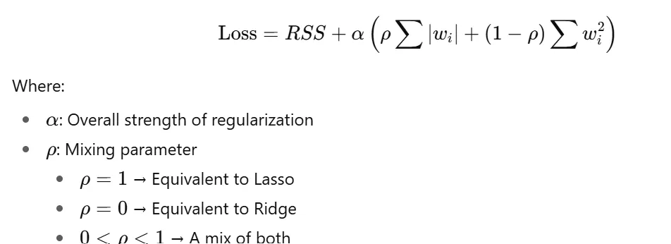

# Elastic Net Regression

To minimize overfitting in Machine Learning, Reqularizations techniques are applied which helps to enhance the model's generalization performances. Elastic Net Regression is a regularization technique that combines both **L1 (Lasso)** and **L2 (Ridge)** penalties. This combination allows ElasticNet to handle scenarios where there are multiple correlated features, providing a balance between the sparsity of Lasso and the regularization of Ridge. In this article we will implement and understand the concept of Elasticnet in Sklearn.


## Elastic Net
- Reduce Overfiting
- Feature Selection


## 🧮 Mathematical Formulation

```
Formula : Cost_Function + Lass Regression + Redge Regression

```
When we compared these two with cost function that's called Elastic Net.


## How Elastic Net Helps
# Elastic Net solves two key problems:
- Large Feature Sets: It performans both shrinkage and feature selection, balancing between Ridge and Lasso.
- Multicollinearity : occurs in regression analysis when independent variables are highly correlated, making it difficult to isolate their individual effects on the dependent variable. It causes unstable, unreliable, and difficult-to-interpret coefficients, along with inflated standard errors. It does not reduce predictive power but hinders explanation. So ElasticNet handles correlated features better than Lasso alone.
