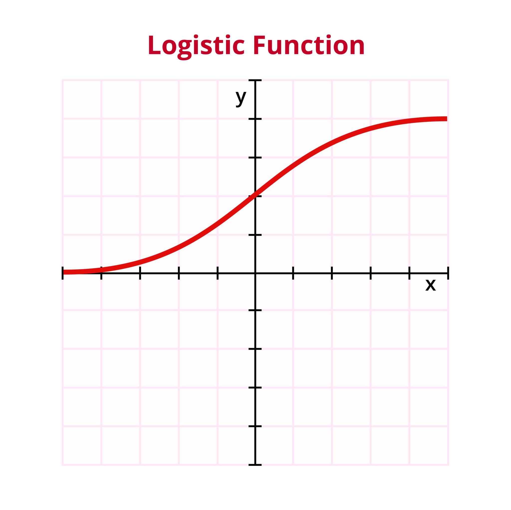

## Logistic Regression

Logistic regression is a statistical method for predicting binary classes. The outcome or target variable is dichotomous in nature. Dichotomous means there are only two possible classes. For example, it can be used for cancer detection problems. It computes the probability of an event occurrence.
It is a special case of linear regression where the target variable is categorical in nature. It uses a log of odds as the dependent variable. Logistic Regression predicts the probability of occurrence of a binary event utilizing a logit function. 

## The Sigmoid Function
The core of logistic regression is the sigmoid (logistic) function, which maps any real-valued number into a value between 0 and 1.

Formula : $$\sigma(z) = \frac{1}{1 + e^{-z}}$$

## The Hypothesis Function
In a Machine Learning context, we replace z with the linear combination of inputs (x) and weights(w).

$$h_\theta(x) = P(y=1|x; \theta) = \frac{1}{1 + e^{-(\theta^T x)}}$$

- $\theta^T x$: Represents the dot product of the parameter vector and the feature vector (including the bias/intercept).

## The Cost Function (Log Loss)
Since logistic regression predicts probabilities, we use Binary Cross-Entropy (Log Loss) instead of Mean Squared Error to keep the function convex for optimization.

$$J(\theta) = -\frac{1}{m} \sum_{i=1}^{m} [y^{(i)} \log(h_\theta(x^{(i)})) + (1 - y^{(i)}) \log(1 - h_\theta(x^{(i)}))]$$